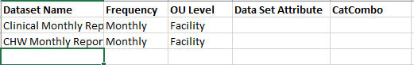
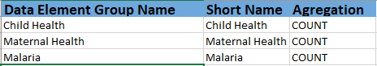
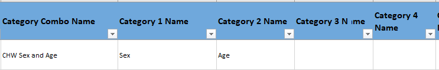
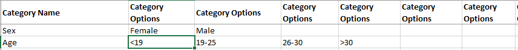

```{r "setup", include=FALSE}
# This makes sure we're using the root dhis2R directory when running the file
require("knitr")
opts_knit$set(root.dir = "../")
```

Note:
This is an [R Markdown](http://rmarkdown.rstudio.com) Notebook. When you execute code within the notebook, the results appear beneath the code. 

Try executing this chunk by clicking the *Run* button within the chunk or by placing your cursor inside it and pressing *Ctrl+Shift+Enter*. 

```{r}
# Import the functions and your username, password, and url settings defined in settings.R
source('settings.R') 
setDHIS2_credentials('dhis2_demo')
```

# Table of Contents
* [Creating the file](#creating-the-file)
* [Scraping the file](#scraping-the-file)
* [Uploading the file](#uploading-the-file)

## Creating the file
There's a template file that can serve as a starting point for configuring a new form/program in DHIS2.  Because the UI can be a headache when trying to configure a large number of dataElements and disaggregations, this file can help ease your pain.  This only works for the aggregate space within DHIS2.  Unfortunately, you're on your own for Tracker at the moment. 

[Open the file](../templates/Excel_Configuration_Template.xlsx).  You'll see multiple tabs in the worksheet, each corresponding to the different aggregate configuration pieces you'll need to make when setting up a new form.  Because you need to bounce around to multiple places when setting up configurations in DHIS2, this lets you do that more easily.  Start with the `Data Elements` tab. 

Just like in the UI, you have columns for each property of the dataElements you want to create.  Fill in the Data Element Name, Short Name, Code (if applicable), and Description of the dataElements you want to create.  Be careful with your shortNames since those values also have to be unique and can cause a lot of headaches if you have duplicates in a configuration file!

\

Next, scroll to the right and fill in the Form Name, Dataset, Data Element Group, Value Type, and Aggregation Type columns.  The Dataset and Data Element Group columns have a validation rule that provides a dropdown from the Data Sets and Data Element Groups tabs respectively.  As you fill out information about dataElements, you can flip over to those tabs and add options as needed.

Data Sets:



Data Element Groups:



Finally, add in the Category Combo Name and assign the categories you want to use.  Just like the Data Sets and Data Element groups, there are dropdowns that limit what you can enter.  If you need to repeat a categoryCombo, just repeat the whole line with the assigned categories.  The full file has a better example of how that works. Here's a screen shot of the first row:



And the Category Options tab:



The scraping script will not be happy if you leave empty rows in any of the sheets, so make sure to check for that!  It will still require a high attention to detail to make sure that your metadata has been configured appropriately, but if you can get the hang of this, it will save you lots of time when setting up new forms in the system.  


## Scraping the file
So you've made the configuration file, but now you need to convert it into a format that DHIS2 wants.  You've probably already used all of the *createDHIS2_X* functions if you've run through the [creating payloads](Payloads_and_posting.Rmd) notebook.  You could do it all manually by scraping in the sheets and making the relationships, but I've written a function that can make your life a lot easer.  `scrapeDHIS2_configFile()` imports the worksheets, checks with the DHIS2 server for existing objects (any matching `categoryOptions`, `categories`, `categoryCombos`, `dataElements`, `dataElementGroups`, and `dataSets`) and pulls the existing IDs or creates new ones for non-existing objects, and creates the relationships necessary between them.  This means you can run one function, and it will do all of the payload creation for you.  Check it out:
```{r}
config <- scrapeDHIS2_configFile('templates/Excel_Configuration_Template.xlsx',usr, pwd, url, warn=F)
```

You can see that the function gives you a time elapsed and then a summary of the objects it imported.  In that time, it has created everything you need to upload to the system.  When I just ran it, I got a result of 2.5 seconds.  That's a lot faster than I could do it manually! Let's inspect this object a little more.  I've stored the scraped results in the `config` object.  Inside of that, there are lists for each object type.  You could look at `config$categoryOptions` to see what `categoryOptions` will be uploaded or `config$dataElements` etc. 
```{r}
config$categoryOptions
```

See how two have a property of `href` but the others don't?  That's because those `categoryOptions` already exist in the DHIS2 system.  Behind the scenes, we'll use that when posting data to DHIS2. 

Just like when you did it on an individual basis, you can inspect each metaData object.  Let's look at the first dataSet.
```{r}
config$dataSets[[1]]
```

Notice how all of those `dataSetElements` have id values?  `scrapeDHIS2_configFile()` took care of that for you and then made sure to place it in the other related places.  These are all unique ids generated from `getDHIS2_systemIds()` that you used in the payload creation notebook.  The examples we did used a `NULL` value, but here, the function generates ids and uses them when creating the payloads.  Basically, it's doing the work for you. 

A few warnings.  If you create a `category` in the config file that already exists in the system, that will work provided it has the same `categoryOptions` associated.  If there are different ones, you'll get some errors. 

## Uploading the file
Technically it's not a file anymore, but we're ready to upload that configuration.  Technically, you could use `postDHIS2_metaData()` function and sending it to the `metadata` endpoint, but I've run into some problems sometimes with trying to do that all at once.  So there's `uploadDHIS2_metaData()` which essentially does the same thing, just one at at time.  It's as though you sent all the `categoryOptions`, and then the `categories`, and then the `categoryCombos`, etc. 

We already have the config bundled into one list, so there's no more manipulation that you need to do.  It's ready to go. 
```{r}
upload_result <- uploadDHIS2_metaData(config, usr, pwd, url)
print(upload_result)
```

`200` is good!  Let's see if the first dataElement we created is there. We still have the `config` object that we can use to find the id value and then check that it's been created in the system using `getDHIS2_elementInfo()`. 
```{r}
getDHIS2_elementInfo(config$dataElements[[1]]$id, 'dataElements', usr, pwd, url)
```

Looks great!  This gives you better insight into how well the objects are uploading.  I've run into challenges sometimes once I get to `dataElements` because of invalid `shortNames`, which then causes the `dataElementGroups` and `dataSets` creation to fail. If you really aren't sure why things are going wrong, you could always use `lapply()` on the objects within each object type in the `config` object to get individual statuses for creation.  Just remember that if some of them have already been created, you'll see `409` errors for those. 

## What this doesn't do
This gets you most of the way there.  There are still some things you'll need to do manually either via the API or sign in to the UI to finish off. 
* Data Sets
  + Assign to Organisation Units
  + Create section forms or custom forms
  
Other than that, you should be ready to go for aggregate data collection. 

## Adding old data to DHIS2
We'll use this later on too but here's a preview.  The *prepareDHIS2_dataValues()* function does that thorough checking of dataElements + categoryOptionCombos investigation since we need the IDs to match exactly when uploading to the system.  The reason this is a challenge is that each categoryCombo generates it's own unique set of categoryOptionCombos.  So if "HIV Testing Age and Sex" has a categoryOptionCombo of "15, M" and "TB Treatment Age" also happens to have "15, M", the categoryOptionCombo on the backend will have a different ID.  Here's how to use it:
```{r}
# ready_for_upload <- prepareDHIS2_dataValues(converted_df, usr, pwd, url)
# head(ready_for_upload)
```